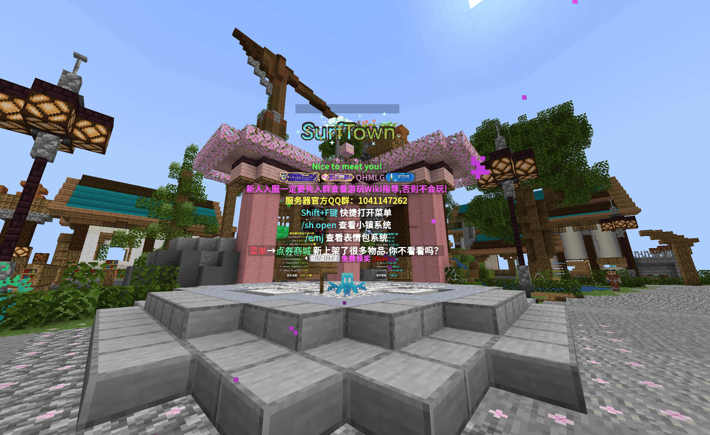
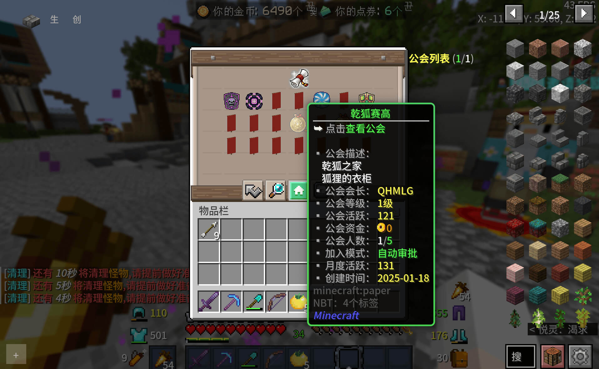
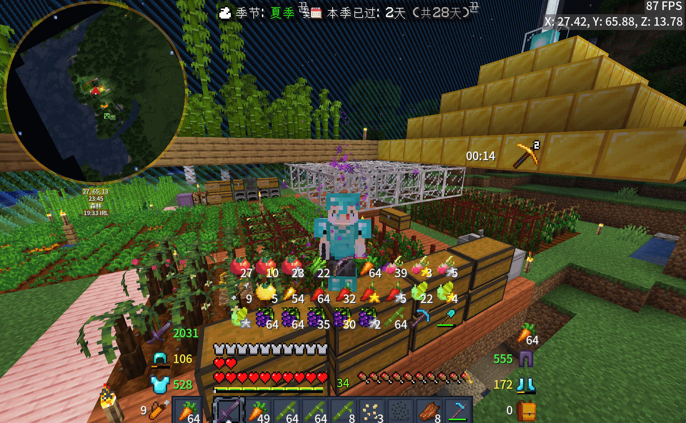

使用**MineCraft Java Edtion 1.20.4**版本的客户端 
在**多人游戏**中添加服务器IP`MC.SurfTown.CN`即可进入服务器游玩! 
请在游玩前查阅[服务器wiki](https://www.yuque.com/yixian-wiolh/okb9cz)以获取帮助 
[服务器官方群QQ](https://qm.qq.com/q/9Z5Z8RINjy)

---

## 如何和我一起玩?

### 进入游戏

按官方指引进入游戏,注册并登录后 
你最好先前往右手边`每日签到`进行签到 
接下来按`Shift+F`或输入`/cd`指令打开主菜单 
推荐你先看wiki熟悉主菜单再继续游玩

### 进入公会

在`主菜单-公会`中找到`乾狐赛高`公会

加入后你可点击公会菜单中的`传送至公会主城`来到**我的小镇** 
我会为你提供基础的装备和资源供你开局

你也可以在`主菜单-传送-小镇`内创建自己的小镇

### 我的商店

你可以在`主菜单-地标`中找到`桃花源小铺` 
这是我的商店,提供便宜的商品 
我的商店并不以盈利为目的,所以价格低廉,欢迎您的来访

> 星露谷农作物四折 
> 原版农作物/战利品二折
> 另有杂项物品贩卖

### 我的小镇

我的小镇作为公会主城,将持续为大家提供资源及资金 
因为每人每日农作物贩卖量存在上限,多余农作物将会放入商店以供交易

### 邀请码

图穷匕见了呢! 
你需要**游玩8小时**且**等级大于等于30级**才可以接受我的邀请,所以这个暂且不提
